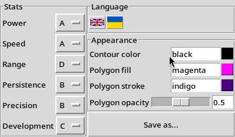
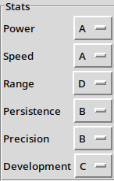
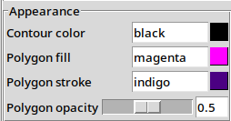
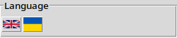
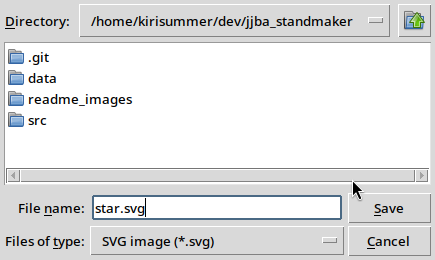

# JJBA Stand maker
## Description
This program is able to create stand stat image in SVG.

## Features
- Adjust color of the stat polygon stroke and fill, frame's stroke color
- Adjust stand stats
- Adjust stat polygon's opacity
- Easy-to-modify SVG image on output

## Usage
### Adjust stats
You can adjust every stand stat from A to E by selecting
corresponding letter in drop-down list

### Adjust colors
You can adjust colors of the image. To do this, select the color you want to change
and write a new one. You can also change stat polygon's opacity.
[Available colors](https://developer.mozilla.org/en-US/docs/Web/CSS/color_value)
(not working correctly: [issue #11](https://github.com/LyraLover/jjba_standmaker/issues/11))

### Select language
You can select your language by clicking a button with a flag.
Currently available languages: English, Ukrainian

### Save
You can save the image by clicking "Save" button. You will be prompted to select a file to save to.

